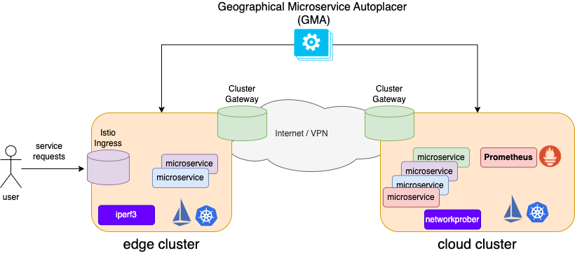
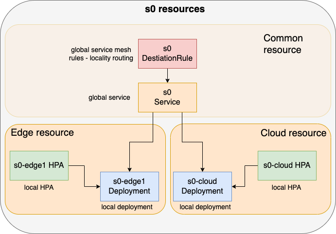
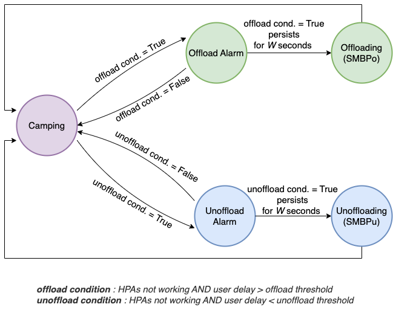

# Geographical Microservice Autoplacer

In a Multi-Cluster Kubernetes environment consisting of cloud and edge clusters, the Geographical Microservice Autoplacer (GMA) automatically runs microservices (such as Deployments or StatefulSets) on edge clusters to ensure that the average user delay remains within predefined thresholds. The set of offloaded microservices is chosen to minimize CPU, memory, and network costs applied by the cloud operator.


GMA is implemented as an external Kubernetes controller, written in Python, that uses the Kubernetes Python client to interact with the Kubernetes API server. It also interacts with a Prometheus server of the Istio service mesh to collect telemetry data.

An instance of GMA applies to a single cloud-edge cluster pair and is responsible for a single microservice application. For multi-edge cluster scenarios, multiple instances of GMA can be deployed, each responsible for a single cloud-edge pair.

## Infrastructure Configuration



GMA assumes the presence of an infrastructure made up of:
- **A Kubernetes Multi-Cluster Environment**: This environment consists of a cloud cluster and one or multiple edge clusters. The multi-cluster framework is out of the scope of GMA, but it is possible to use available tools such as [liqo.io](https://liqo.io), [Istio-multi-cluster](https://istio.io/latest/docs/setup/install/multicluster/), or any other multi-cluster Kubernetes solution. <u>POD CIDRs must be different for cloud and edge data cluster</u>.
- **An [Istio](https://istio.io) Service Mesh**: This service mesh collects telemetry data on a single Prometheus server and uses [Locality Load Balancing](https://istio.io/latest/docs/tasks/traffic-management/locality-load-balancing/).
- **Edge Users**: These users access the application from the edge cluster through an [Istio Ingress Gateway](https://istio.io/latest/docs/tasks/traffic-management/ingress/ingress-control/).

## Microservice Configuration



GMA assumes that a microservice application is made of a group of microservices, each implemented as a set of Kubernetes Pods controlled by a Kubernetes Deployment (or StatefulSet). Different clusters should use different Deployments per microservice. For example, in the figure, the microservice *s0* is implemented as a Deployment *s0-cloud* in the cloud cluster and as a Deployment *s0-edge1* in the edge cluster.

These Deployments can differ in names, labels, and topology affinity rules, but they run the same container image of the microservice and should have a common label to be hooked by a common Service, e.g., `s0`.

Replication of the Pods of cloud and edge Deployments should be controlled by independent HPAs per cluster based on CPU utilization metrics. GMA takes placement action on edge microservice only if the edge and cloud HPAs are not active and delay objectives are not met.

An Istio Destination Rule per Service should be configured to enable Istio Locality Load Balancing.

## Persistent Cloud - Ephemeral Edge
GMA does not handle the creation or deletion of cloud microservices. Consequently, GMA operates based on the following properties:

- **Persistent Cloud**: The cloud cluster should persistently run the entire set of microservices according to the microservice configuration described above. This persistent cloud configuration should be created manually.
- **Ephemeral edge**: Edge cluster dynamically runs a subset of microservices chosen by GMA to ensure that the average user delay remains within a higher value, defined as the *offload threshold*, and a lower value, defined as the *unoffload threshold*.

## GMA State Machine



GMA is implemented as a state machine with the following states:
- **Camping**: GMA monitors telemetry data and HPA activity. When the average user delay is within the offload and unoffload thresholds, or any HPA is active, GMA remains in this state.
- **Offload Alarm**: GMA observes a user delay above the offload threshold and no HPA is active.
- **Unoffload Alarm**: GMA observes a user delay below the unoffload threshold and no HPA is active.
- **Offloading**: GMA has been continuously in the Offload Alarm state for a period of stability *W* and is now offloading microservices to the edge cluster to ensure user delay requirements. Once the offloading action is completed, GMA switches to the Camping state.
- **Unoffloading**: GMA has been continuously in the Unoffload Alarm state for a stability period *W* and now is unoffloading microservices from the edge cluster to save cost. When the unoffload action is completed, GMA moves to the Camping state.

## GMA Strategy Connector

GMA is agnostic to the offloading and unoffloading strategies that decide which microservices to add or remove from the edge cluster. These strategies are implemented in a separate component called `Strategy_Connector`, which is invoked by GMA during offload or unoffload actions. The description of the `Strategy_Connector` is available in this [document](strategies/Strategy_Connector.md).
The `Strategy_Connector` is implemented as a Python class that should be included in the `strategies` folder. The available strategy connectors are:

- SBMP_GMA_Connector: A strategy connector that uses the [SBMP](https://www.techrxiv.org/users/748014/articles/1256305-cost-effective-cloud-edge-elasticity-for-microservice-applications) algorithm to decide which microservices to offload or unoffload.

## GMA Configuration
GMA is configured using a [GMAConfig.yaml](GMAConfig.yaml) file that contains information about:

- **Service Level Objective**: The `slo` section defines offload and unoffload delay thresholds.
- **Telemetry Data**: The `telemetry` section includes information to fetch telemetry data such as the Prometheus server address, query period, and stability period *W*.
- **Cloud and Edge Areas**: The `cloud-area` and `edge-area` sections include information about the Kubernetes context that GMA should use to apply the recommnded placement configuration returned by the `Strategy_Connector`. In addition, the section includes informatin about the CIDR of the PODs used to identify the PODs in the areas, the `cluster` label reported by Istio Prometheus metrics, and the cost of CPU, memory, and external network traffic for the cluster. Additionally, it includes information about the `istio` resources running in the cluster.
- **Network Information**: The `network` section includes information about the default network RTT and bitrate between the cloud and edge clusters. It also includes an `edge-cloud-rtt-multiplier` applied to the network RTT to obtain gRPC/HTTP-level round-trip time that should be manually configured.
- **Placement Optimizer Information**: The `optimizer` section includes information about the placement algorithm used by GMA. The `connector` field specifies the `Compute_Placement` to be used, whose Python file should be included in the `strategies` folder. Other optional keys are specific to the placement algorithm.
- **Application Information**: The `app` section includes information about the `namespace` of the application and its microservices (`services`). This includes the service `name`, the service `id` used internally by GMA (must be an integer sequence starting from 0), and the Kubernetes YAML files used by the cloud and edge microservices (e.g., Deployment, HPA, etc.). YAML files of the edge cluster are applied or deleted by GMA as a result of offload or unoffload actions. All YAML files are parsed by GMA to extract the information needed to control the microservices of the application.

For more detailed information, refer to the comments in the [GMAConfig.yaml](GMAConfig.yaml) file.

## Network Probing

GMA reads the edge-cloud network round-trip time and bitrate from a [netinfo.yaml](netinfo.yaml) file. This file can be manually configured. Its content is as follows, where the cloud edge bitrate is 199 Mbps and the RTT is 20 ms:

```yaml
apiVersion: gma/v0
kind: NetInfo
spec:
  cloud-edge-bps: 199Mbps
  edge-cloud-bps: 199Mbps
  edge-cloud-rtt: 20ms
```

Any tool can be used for updating this file offline if necessary. Alternatively, GMA invokes a network probing tool within the Offloading and Unoffloading states by using the URL specified in the `net-prober-url` section of the [GMAConfig.yaml](GMAConfig.yaml) file. The net-prober HTTP server should reply with a JSON content with the following keys.

```json
{
  "cloud-edge-bps": "199Mbps",
  "edge-cloud-bps": "199Mbps",
  "edge-cloud-rtt": "20ms"
}
```

### GMA NetworkProber

GMA includes a simple network probing tool called `networkprober`. The `networkprober` should be run in the cloud cluster by using the [netprober.yaml](netprober/netprober.yaml) Kubernetes file, which exposes the `networkprober` service as a NodePort on port 30123.

The `networkprober` uses two network probing tools:
- The network probing tool [iperf3](https://iperf.fr/) to measure the network bitrate with UDP between the cloud and edge clusters. Iperf3 should be manually run in the edge cluster.
- The network probing tool `ping` to measure the network RTT between the cloud and edge clusters. Ping access should be manually enabled for the cloud and edge clusters.

Once running, the network probing tool can be invoked by using the following URL:

```
http://<cloud-ip-address>:30123/get?server_ip=<iperf3-server-ip>&server_port=<iperf3-server-port>&bandwidth_mps=200&duration=2
```

where:
- `<cloud-ip-address>` is the IP address of a cloud server with NodePort access.
- `server_ip` is the IP address or name of the edge iperf3 server (e.g., `gma-netprober.gma-netprober.svc.cluster.local` DNS name). `server_ip` is also used for the ping test.
- `server_port` is the iperf3 port (e.g., 5201).
- `bandwidth_mps` is the maximum UDP bitrate in Mbps sent by the networkprober to the iperf3 server (e.g., 200).
- `duration` is the duration of the probing test in seconds (e.g., 2).

## Running GMA

Once the GMA configuration is set, GMA can be run with INFO level logging using the following command:

```sh
python3 GMA.py --configfile <path-to-GMAConfig.yaml> --loglevel INFO
```

## Examples
Examples of GMA configurations and Kubernetes YAML files are available in the [examples](examples) folder for the following scenarios:
- [Multi-cluster Liqo](examples/liqo)

## Acknowledgments
This work was supported by 
- the European Union's Horizon Europe research project [FLUIDOS](https://fluidos.eu) within the subproject FLUIDOSMESH of 1st Open Call.
- The European Union under the Italian National Recovery and Resilience Plan (NRRP) of NextGenerationEU, partnership on “Telecommunications of the Future” (PE00000001 - program "[RESTART](https://www.fondazione-restart.it)").

## Reference paper
Andrea Detti, Alessandro Favale: "Cost-Effective Cloud-Edge Elasticity for Microservice Applications", TechRxiv. January 07, 2025, DOI: 10.36227/techrxiv.173626716.63354758/v1 [pdf](https://www.techrxiv.org/users/748014/articles/1256305-cost-effective-cloud-edge-elasticity-for-microservice-applications)